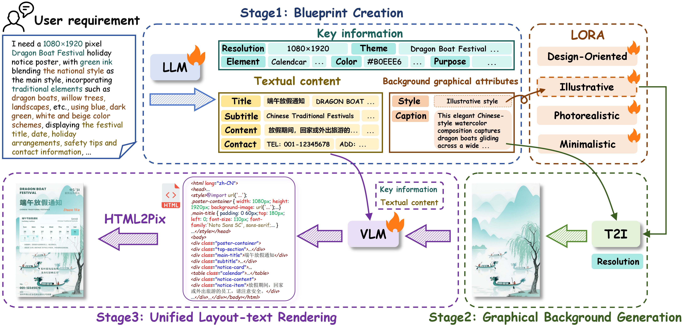
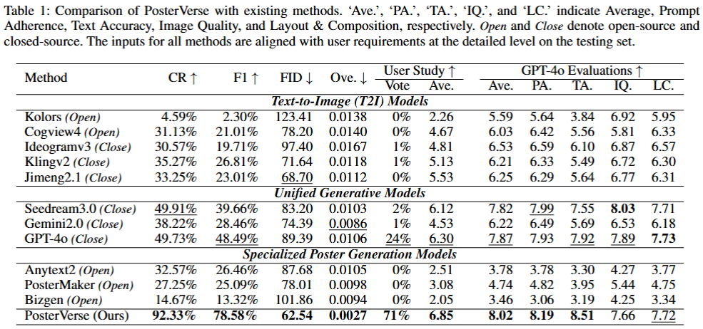

<div align=center>

# [AAAI 2026 Oral] PosterVerse: A Full-Workflow Framework for Commercial-Grade Poster Generation with HTML-Based Scalable Typography

</div>

<div align="center">
  <a href="http://dlvc-lab.net/lianwen/"></a>
  <a href="https://arxiv.org/abs/2601.03993"></a>
  <a href="https://huggingface.co/wuhaer/PosterVerse"></a>
<p></p>

</div>

## 🌟 Highlights
- **PosterVerse**

- **PosterDNA**


- We propose **PosterVerse**, a full-workflow method that integrates blueprint creation, graphical background generation, and unified layout-text rendering, enabling the creation of posters with aesthetically sophisticated layouts and text-dense designs for commercial-grade use.
- We propose **PosterDNA**, the first commercial-grade and text-dense poster generation dataset with fine-grained HTML-based specifications, designed to support modular training and validation with high-quality samples.
- PosterVerse allows users to generate commercial-grade posters solely from textual prompts.
- Extensive experiments demonstrate that PosterVerse can generate visually appealing posters with aesthetic designs, precise text, and well-crafted layouts, meeting the standards of commercial-grade posters.

## 📏 Evaluation Result


## 📅 News
- **2026.04.14**: Release the PosterDNA dataset.
- **2026.04.14**: Release the pretrained model.
- **2026.01.29**: Release the inference code.
- **2026.01.08**: Our [paper](https://arxiv.org/abs/2601.03993) is now available on arXiv.
- **2025.11.08**: 🎉🎉 Our [paper](https://arxiv.org/abs/2601.03993) is accepted by AAAI Oral.

## 🚧 TODO List

- [x] Release inference code
- [x] Release pretrained model
- [x] Release dataset
- [x] Upload pretrained model to Hugging Face

## 🔥 Model Zoo
| **Stage**    | **Checkpoint** | **Status** |
|----------------------------------------------|----------------|------------|
| Blueprint Creation   |  [BaiduYun:CZWV](https://pan.baidu.com/s/1EknntmUiM407ynD6m5tiaQ?pwd=CZWV ) / [Huggingface](https://huggingface.co/wuhaer/PosterVerse)| Released  |
| Graphical Background Generation | [BaiduYun:s47v](https://pan.baidu.com/s/1R6p9dwxqT4E4eKMFn-pzBw?pwd=s47v) / [Huggingface](https://huggingface.co/wuhaer/PosterVerse) | Released  |
|Unified Layout-Text Rendering | [BaiduYun:4G6s](https://pan.baidu.com/s/1EqZdWYdLtS5Tqp3OPs5FYA?pwd=4G6s ) / [Huggingface](https://huggingface.co/wuhaer/PosterVerse) | Released  |

## 🔥 PosterDNA Dataset
| **Dataset**             | **Link** | **status** |
|----------|----------|-------------|
| PosterDNA | [BaiduYun:2112](https://pan.baidu.com/s/1I8x9vqdmHAxzVv4Y03x9Aw?pwd=2112) / [Huggingface](https://huggingface.co/wuhaer/PosterVerse) | Released |

**Note:**
- The PosterDNA dataset can only be used for non-commercial research purposes. For scholar or organization who wants to use the PosterDNA dataset, you can apply through either of the following two options:

  **Option A: Apply Online**
  Submit your application through our online platform: 👉 [Apply Here](http://121.41.49.212:9000/)

  **Option B: Apply via Email**
  Please first fill in this [Application Form](./application-form/Application-Form-for-Using-PosterDNA.docx) and sign the [Legal Commitment](./application-form/Legal-Commitment.docx) and email them to us ([eelwjin@scut.edu.cn](mailto:eelwjin@scut.edu.cn)). When submitting the application form to us, please list or attached 1-2 of your publications in the recent 6 years to indicate that you (or your team) do research in the related research fields of poster generation, layout design, font generation, and so on.

- We will give you the decompression password after your application has been received and approved.
- All users must follow all use conditions; otherwise, the authorization will be revoked.

## 🚧 Installation

### Environment Setup
Clone this repo:
```bash
git clone https://github.com/wuhaer/PosterVerse.git
```

**Step 0**: Download and install Miniconda from the [official website](https://docs.conda.io/en/latest/miniconda.html).

**Step 1**: Create a conda environment and activate it.
```bash
conda create -n posterverse python=3.10 -y
conda activate posterverse
```

**Step 2**: Install the required packages.
```bash
pip install -r requirements.txt
```

## 📺 Inference

**Step 0**: Download all model files from the [Model Zoo](#-model-zoo) 

**Step 1**: Download the [Flux.1 dev](https://hf-mirror.com/black-forest-labs/FLUX.1-dev) model

**Step 2**: Using PosterVerse to generate posters:

```bash
CUDA_VISIBLE_DEVICES=<gpu_id> python pipe_infer.py \
--stage1_model_path /path/to/Blueprint Creation/model \
--stage3_model_path /path/to/Unified Layout-Text Rendering/model \
--lora_local_path lora_model \
--request_prompt '能不能给我来一张以绿色为主色调、画布大小1080×1920的立春节气海报？风格清新唯美，画面要有树叶、樱花、古风人物等元素。主标题"立春"，配上古诗文案，营造春意盎然的感觉，体现出节气特点，展示春天的美好。'
```

## 💙 Acknowledgement
- [xflux](https://github.com/XLabs-AI/x-flux)
- [Qwen](https://github.com/QwenLM/Qwen3)
- [diffusers](https://github.com/huggingface/diffusers)

## ☎️ Contact
If you have any questions, feel free to contact [Junle Liu](https://github.com/wuhaer) at [junle_liu@foxmail.com](junle_liu@foxmail.com)


## 📜 License
The code and dataset should be used and distributed under [(CC BY-NC-ND 4.0)](https://creativecommons.org/licenses/by-nc-nd/4.0/) for non-commercial research purposes.

## ⛔️ Copyright
- This repository can only be used for non-commercial research purposes.
- For commercial use, please contact Prof. Lianwen Jin (eelwjin@scut.edu.cn).
- Copyright 2026, [Deep Learning and Vision Computing Lab (DLVC-Lab)](http://www.dlvc-lab.net), South China University of Technology. 


## ✒️Citation
If you find PosterVerse helpful, please consider giving this repo a ⭐ and citing:
```latex
@inproceedings{Liu2026posterverse,
      title={PosterVerse: A Full-Workflow Framework for Commercial-Grade Poster Generation with HTML-Based Scalable Typography}, 
      author={Junle Liu, Peirong Zhang, Yuyi Zhang, Pengyu Yan, Hui Zhou, Xinyue Zhou, Fengjun Guo, Lianwen Jin},
      journal={Proceedings of the AAAI Conference on Artificial Intelligence},
      year={2026},
}
```
Thanks for your support!

## 🌄 Gallery


## ⭐ Star Rising
[](https://star-history.com/#wuhaer/PosterVerse&Timeline)
